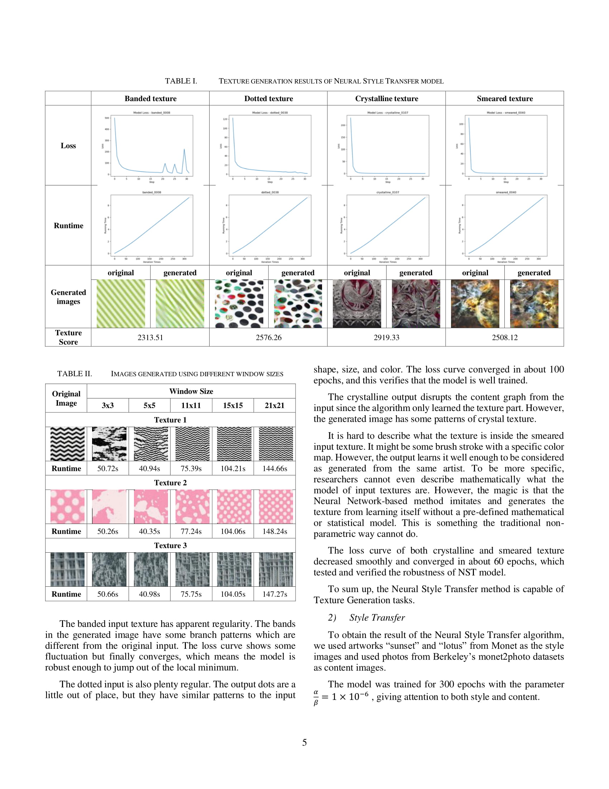

# Texture Generation
Texture generation and style transfor using several methods:
1. Non-parametric texture generation
2. Neural Style Transfer (CNN-based)
3. Cycle-GAN based texture generation

The details of the experiments and results are in the docs/report.pdf file.

## Report

